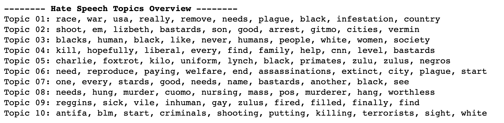
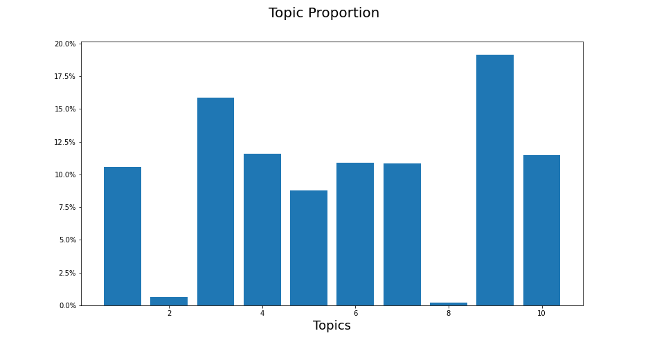
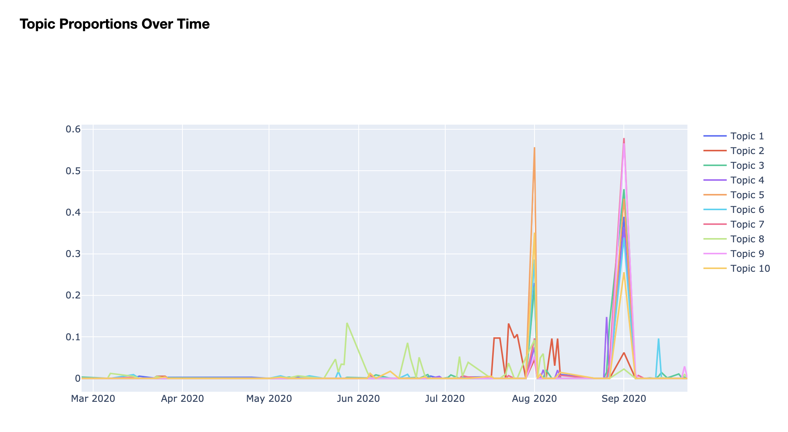
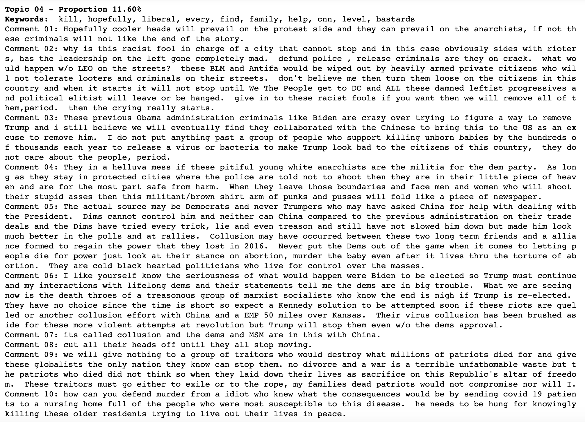
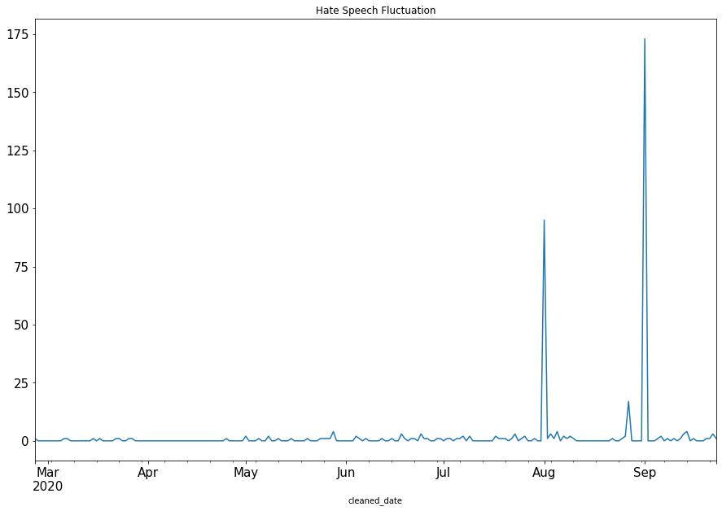
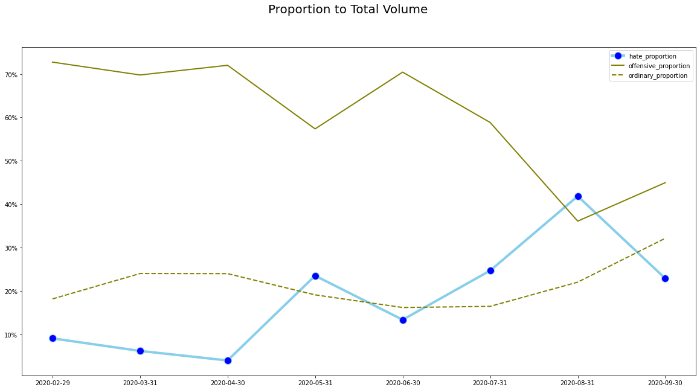
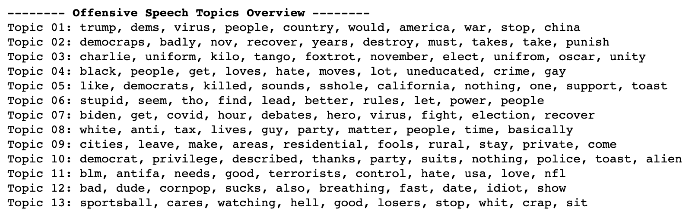

# Analysis of Online User Comments
This analysis was based on web scraping comments from Disqus, an online public comment sharing platform where users create profiles to participate in interactive conversations. 

# Overview - Topic Modeling
Topic Modeling is an unsupervised NLP method which aims to discover the abstract "topics" (themes) that are present in a collection of documents (in this case, a bunch of comments). Specifically, I used Nonnegative Matrix Factorization (NMF), which is widely used for dimensionality reduction as it automatically extracts sparse and meaningful features from a set of nonnegative vectors. 

It's evident that in terms of hate speech, comments are either extremely racist (topic 1) or indicate violent intentions/behaviors (topic 4). 

Data visualizations are also included to strengthen the analysis. For example, we can see that almost 20% of tokenized comments fall under topic 9, a highly racist topic with racial slurs and demeaning words. In addition, the proportion of comments under this topic (pink line) also began spiking from August to September, which corresponds to the heightened racial tensions in the United States following the Black Lives Matter movement and months of protests during the summer. Note that the topic proportions over time graph is supposed to be interactive, which utilizes the plotly library. 

# Detailed Analysis 

Diving even deeper, the top 10 keywords and representative documents (comments) are used to describe a given topic. In this example, topic 4 is filled with users attacking the Democrats (i.e. Obama administration criminals like Biden) as well as displaying violent intentions (i.e. cut all their heads off). 

Interestingly, the proportion of hate speech (to total volume) started increasing since May while the proportion of offensive speech began decreasing. In facts, the hate and offensive speech proportions had been moving inversely, which indicates that users might've started substituting offensive words with more hateful language. 

We can also take a look at the offensive speech topics at a high level: there are a few interesting yet distinct topics, such as topic 13 where people are talking about how they would like to stop watching pro sports such as the NBA. In addition to the racist and violent topics, another fascinating one is topic 7, where users are saying Biden would "get covid an hour before the presidential debate." 

